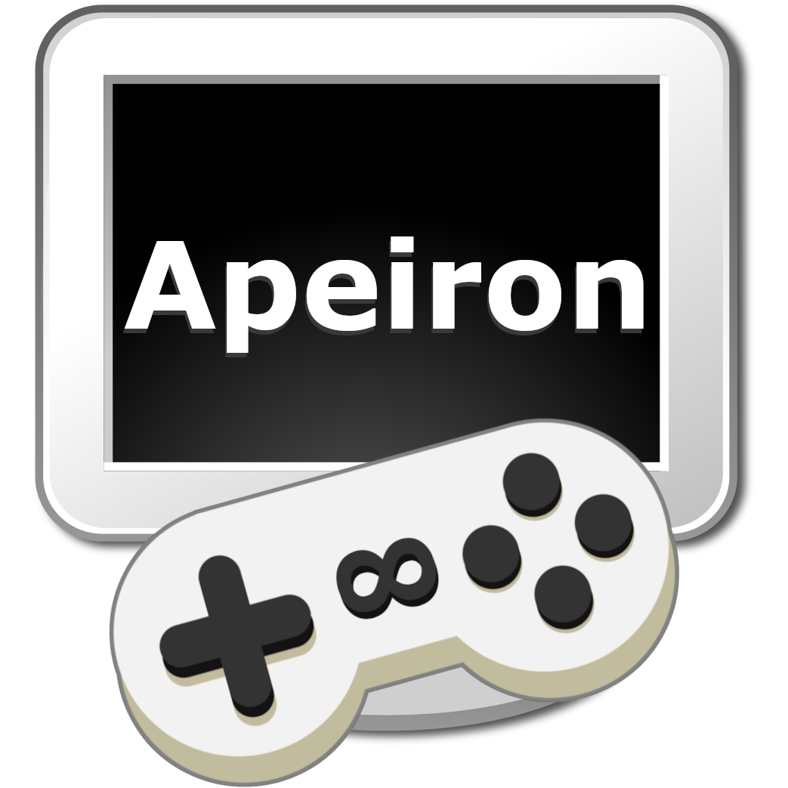

# Apeiron Game Engine

  

Apeiron is a high-level, 2D game engine.. TBC

## Features (ready)
- TBC

## Features (WIP)
- TBC

## Getting Started
To get started, simply follow the instructions in the [Getting Started](GETTING_STARTED.MD) guide.

## Examples

Apeiron comes with a few examples to help you get started. You can find them in the [examples](https://github.com/juan-medina/apeiron/tree/main/examples/README.md) folder.

## Dependencies

Apeiron is powered by these incredible projects:

- TBC

## Resources

Apeiron embeds some resources, than can be used by any game:
 
- TBC

Apeiron examples use these resources:

- TBC

## Contributions

Apeiron is an open source project and contributions are welcome. If you'd like to contribute, please follow the guidelines in the [Contributing](CONTRIBUTING.md) file and make a pull request.

## License
See the [LICENSE](https://github.com/juan-medina/apeiron/blob/main/LICENSE) file for license rights and limitations.