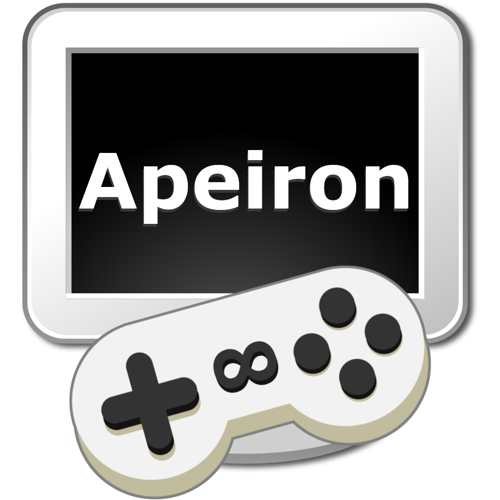

# Apeiron Examples

  

### All examples will

- run in a window that can be resized.
- window size and screen monitor will be saved on closing.
- can toggle between fullscreen and windowed mode by pressing ALT+ENTER.
- will close when the user presses the ESC key.
- handle window resizing and content scaling.

### List of examples

- [Hello](https://github.com/juan-medina/apeiron/tree/main/examples/hello/src) : Simple Text.
